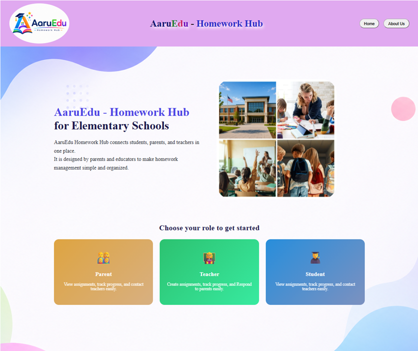
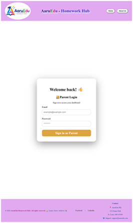
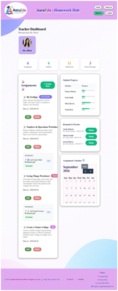
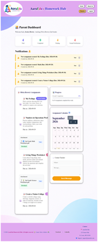
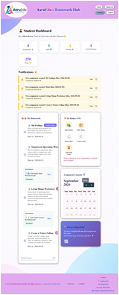
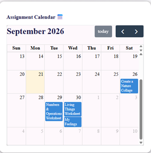
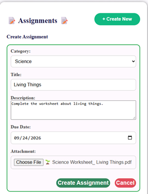
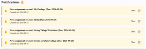

<div align="center">


<hr style="height: 4px; background-color: #333; border: none;">

# 📚 AaruEdu - Homework Hub: Full-Stack Web Application

> Learn. Grow. Achieve.
 
</div>  

<div align="center">


 
 
  <br>


 <br>


 
 
 <br>
 

 
 


</div>

<hr style="height: 4px; background-color: #333; border: none;">

<div align="center">

[About](#-about-the-project) •
[Features](#-features) •
[Tech Stack](#️-technologies-used) •
[Installation](#-getting-started) •
[Database](#️-database-structure-erd) •
[API](#-api-endpoints) •
[Future Features](#-future-features)

</div>

<hr style="height: 4px; background-color: #333; border: none;">


## 📖 About the Project

AaruEdu Homework Hub is a full-stack web application designed to help elementary school parents, teachers, and students manage homework assignments in one central location. The application reduces confusion and lost information that can occur when homework instructions are shared through paper notes or other disconnected methods. Teachers can create, edit, and delete assignments, while parents and students can view assignments, track completion, receive notifications, and access attached files. Parents can also communicate with teachers and monitor their child’s progress, while students can track their own progress and earn rewards for completing their assignments. 

## ✨ Features

- Parent, teacher, and student dashboards
- Create, edit, and delete homework assignments
- Assignment due dates and calendar view
- Assignment completion tracking
- Parent and student notifications
- File attachments for assignments
- File download/viewing
- Separate notification state for users
- Confirmation before deleting assignments
- Responsive design for different screen sizes

## 📸 Key Visuals: 
### Preview of UI:

**🏠 Home Page and 🔐 Login:** 

 

**👩‍🏫 Teacher Dashboard   &nbsp;&nbsp;&nbsp;&nbsp;&nbsp; |  &nbsp;&nbsp;&nbsp;&nbsp;&nbsp; 👨‍👩‍👧 Parent Dashboard  &nbsp;&nbsp;&nbsp;&nbsp;&nbsp; | &nbsp;&nbsp;&nbsp;&nbsp; 🎒 Student Dashboard**

<p>
   &nbsp;&nbsp;
   &nbsp;&nbsp;
  
</p>

**📅 Assignment Calendar**   &nbsp;&nbsp;&nbsp;&nbsp;  |  &nbsp;&nbsp;&nbsp;&nbsp;  **📝 Assignment creation and ⬆️ File uploading** 

<p align="top">
 &nbsp;&nbsp;
   &nbsp;&nbsp;<br> 

 **🔔 Notifications**


</p>

## 🛠️ Technologies Used


## 🌐 Front End

| Technology | Purpose |
|---|---|
|| Core programming language |
|| User interface |
|| Development and build tool |
| | Application routing |
| | Styling and responsive design |
| | Assignment calendar |
|| API communication |

## ⚙️ Back End

| Technology | Purpose |
|---|---|
| | Backend programming language |
| | Backend framework |
| | REST API |
| | Data persistence |
| | ORM |
| | Dependency management |


## 🗄️ Database

| Technology | Purpose |
|---|---|
| | Relational database |
| | Object-relational mapping |


## 🛠️ Development Tools
- 
- 
- 
- 
- 

<hr style="height: 4px; background-color: #333; border: none;">

## 🧪 Testing & 🐛 Debugging

| Technology | Purpose |
|---|---|
| | Automated testing |
| | In-memory testing database |
| | Browser debugging and testing |

<hr style="height: 4px; background-color: #333; border: none;">

## 🚀 Getting Started

### ✅ Prerequisites

Before running the application, make sure you have:

- Java 21
- Node.js and npm
- MySQL
- Git
- Visual Studio Code (VS Code)
- IntelliJ IDEA

#

### 📥 Clone the Repository

git clone https://github.com/pujajathar/Homework-Hub-Full-Stack-App

---

### 🌐 Front End Setup (React/Vite)

1. Navigate to the frontend project directory:

    ```
      cd homework-hub-frontend-app
    ```
2. Install the required dependencies:

    ```
      npm install
    ```
3. Start the React/Vite development server:

    ```
      npm run dev
    ```
4. The frontend runs at:

    http://localhost:5173

--- 

### ⚙️ Backend Setup (Java/Spring Boot/MySQL)

1. Open the backend project in IntelliJ IDEA.

2. Create the MySQL database:

    ```
      CREATE DATABASE homework_hub;
    ```
3. Configure your database credentials using:

    ```
      DB_USERNAME
      DB_PASSWORD
    ```
4. Run the Spring Boot application.

    ```
      HomeworkHubBackendApplication:run
    ```

5. The backend runs at:

   http://localhost:8080

 <hr style="height: 4px; background-color: #333; border: none;">

## 📐 Wireframes

[View the AaruEdu Wireframes in Miro ↗ ](https://miro.com/app/board/uXjVHrsOQm8=/?share_link_id=477954982709)

<hr style="height: 4px; background-color: #333; border: none;">

## 🗃️ Database Structure (ERD)

This project utilizes a MySQL database managed by Hibernate and structured around the following core entities and relationships:

1. **Assignment** ↔️ **Notification**: One-to-Many
2. **Assignment** ↔️ **Attachment**: One-to-Many

### Relationship Overview

| Entity | Relationship | Entity |
|---|---|---|
| Assignment | One-to-Many | Notification |
| Assignment | One-to-Many | Attachment |

### Entity Relationships

- **Assignment → Notification :** One assignment can have multiple notifications.
- **Notification → Assignment :** Each notification belongs to one assignment.
- **Assignment → Attachment :** One assignment can have multiple attachments.
- **Attachment → Assignment :** Each attachment belongs to one assignment.

### Entity Relationship Diagram

Click on the link to view ERD: 

[AaruEdu ERD ↗](https://docs.google.com/document/d/11_BueELD8_yZPCBFL37mHFZGVBXXRh5L5NMsNpt_ghU/edit?tab=t.0)

<hr style="height: 4px; background-color: #333; border: none;">

## 🔌 API Endpoints

### 📝 Assignment API Endpoints

| Method | Endpoint | Purpose |
| --- | --- | --- |
| 🟢`GET`| `/assignments` | Get all assignments |
| 🟢`GET`| `/assignments/{id}` | Get an assignment by ID |
| 🟡`POST`| `/assignments` | Create a new assignment |
| 🔵`PUT`| `/assignments/{id}` | Update an assignment |
| 🔴`DELETE`| `/assignments/{id}` | Delete an assignment |

### 🔔 Notification API Endpoints

| Method | Endpoint | Purpose |
|---|---|---|
| 🟢`GET`| `/notifications` | Get all notifications |
| 🟢`GET`| `/notifications/unread` | Get total unread notifications |
| 🟢`GET`| `/notifications/{id}` | Get a notification by ID |
|🟢 `GET`| `/notifications/parent` | Get all parent notifications |
| 🟢`GET`| `/notifications/parent/unread` | Get unread parent notifications |
| 🟢`GET`| `/notifications/student` | Get all student notifications |
| 🟢`GET`| `/notifications/student/unread` | Get unread student notifications |
| 🟡`POST` | `/notifications` | Create a new notification |
| 🔵`PUT`| `/notifications/{id}` | Update a notification |
| 🔴`DELETE` | `/notifications/{id}` | Delete a notification |

### 📎 Attachment API Endpoints

| Method | Endpoint | Purpose |
|---|---|---|
| 🟡`POST`| `/attachments/upload/{assignmentId}` | Upload an attachment for an assignment |
| 🟢`GET`| `/attachments/download/{id}` | Download an attachment |
| 🟢`GET`| `/attachments/{id}/view` | View an attachment in the browser |
| 🟢`GET`| `/attachments/assignment/{assignmentId}` | Get all attachments for an assignment |
| 🔴`DELETE`| `/attachments/{id}` | Delete an attachment |

<hr style="height: 4px; background-color: #333; border: none;">

## 🔮 Future Features

Potential future improvements include:

- User authentication and authorization
- Persistent user accounts
- More detailed student progress reports
- Cloud-based file storage
- Deployment of the full application

<hr style="height: 4px; background-color: #333; border: none;">

## ⚠️ Known / Unsolved Problems
- The current application uses local file storage for attachments.
- Authentication and authorization are not yet implemented.
- The application currently uses a local development database for testing and development.

<hr style="height: 4px; background-color: #333; border: none;">

## 👩‍💻 Developer

**Puja Jathar** - <u>[GitHub ↗](https://github.com/pujajathar)</u> - <u>[LinkedIn ↗](https://www.linkedin.com/in/puja-j-a09621410/)</u>


  